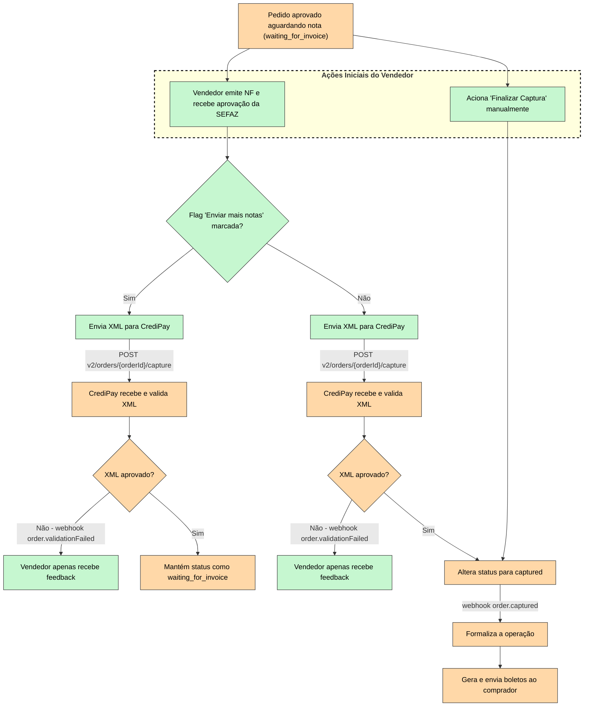

Esta seção descreve o comportamento da nossa API durante o fluxo de envio de múltiplas notas fiscais para um mesmo pedido. O objetivo é orientar o desenvolvedor sobre como o estado do pedido é alterado a cada envio e como consultar essas informações via API.



## Visão Geral do Fluxo de Status

Quando um pedido é criado e aprovado, ele aguarda o envio das Notas Fiscais. Durante o processo de envio de múltiplas notas, o pedido transita pelos seguintes status na API:

* waiting_for_invoice (ou status inicial equivalente de aprovação)
* partially_captured (Recebendo notas de forma fracionada)
* captured (Captura finalizada e ciclo de envio de notas encerrado)

<br />

### Passo 1: Recuperar o ID do Pedido (Order ID)

Para interagir com a API, você precisará do order_id (identificador único do pedido). No vídeo de demonstração, este ID possui o formato UUID (ex: e9feb5aa-0000-...).

Endpoint de Consulta de Pedido:
`GET /v1/sellers/orders/{order_id}`

<br />

### Passo 2: Validando o status de Captura Parcial (partially_captured)

Quando você envia uma Nota Fiscal e sinaliza que enviará mais notas (na interface, marcando o checkbox), a plataforma processa a nota e altera o status do pedido para indicar que a captura ainda está em andamento.

Ao fazer uma requisição GET no pedido após o primeiro envio, a API retornará as seguintes atualizações:

status: O campo será atualizado para "partially_captured".

invoices: Um array será retornado contendo o objeto da Nota Fiscal que acabou de ser processada, incluindo o invoiceNumber (chave de acesso da NF-e) e os valores associados.

Exemplo de Resposta da API (Parcial):

```json
{
  "id": "e9feb5aa-0000-0000-0000-000000000000",
  "status": "partially_captured",
  "totalAmountCents": 10000,
  "invoices": [
    {
      "id": "f2a1b9cc-...",
      "invoiceNumber": "000000000000000000000000000000000017",
      "status": "approved",
      "amountCents": 5000
    }
  ],
  "metadata": { ... }
}
```

### Passo 3: Adicionando Notas Subsequentes

Enquanto o pedido estiver no status "partially_captured", ele continuará apto a receber novas chamadas para inserção de notas.

Sempre que uma nova nota for enviada com a flag de continuidade, o array "invoices" na resposta do GET crescerá, acumulando todas as chaves de acesso vinculadas àquele order_id, e o status se manterá como "partially_captured".

<br />

### Passo 4: Finalizando a Captura (captured)

O ciclo de múltiplas notas é encerrado de duas maneiras:

Ao enviar a última nota fiscal sem a flag de continuidade (via API, enviando a requisição de captura final).

Acionando o endpoint/botão de Finalizar Captura manualmente, quando não há mais notas para enviar, mesmo que o valor total das notas seja inferior ao valor original do pedido.

Ao realizar essa ação, o sistema consolida as informações e gera os boletos.

Validação no Postman:
Ao consultar o pedido novamente via `GET /v1/sellers/orders/{order_id}`, você notará as seguintes mudanças definitivas:

status: O campo agora retorna "captured".

invoices: O array lista todas as notas fiscais validadas (no vídeo, o array exibe duas notas atreladas ao pedido finalizado).

Exemplo de Resposta da API (Finalizada):

```json
{
  "id": "e9feb5aa-0000-0000-0000-000000000000",
  "status": "captured",
  "totalAmountCents": 10000,
  "invoices": [
    {
      "id": "f2a1b9cc-...",
      "invoiceNumber": "000000000000000000000000000000000017",
      "status": "approved",
      "amountCents": 5000
    },
    {
      "id": "a1b2c3d4-...",
      "invoiceNumber": "000000000000000000000000000000000018",
      "status": "approved",
      "amountCents": 5000
    }
  ],
  "metadata": { ... }
}
```

Resumo para o Desenvolvedor
Utilize a rota `GET /v1/sellers/orders/{order_id}` para monitorar o andamento da captura.

O array "invoices" é a sua fonte da verdade para saber quais chaves de acesso já foram atreladas e aprovadas para um determinado pedido.

Apenas pedidos no status "captured" irão gerar recebíveis/boletos para o seu cliente final.
