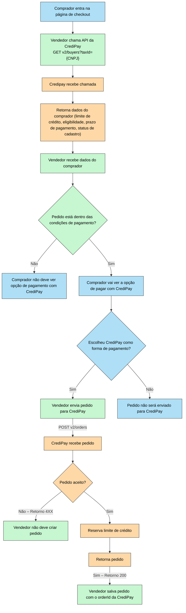

# Introdução

A primeira etapa da integração é o de checagem e reserva de limites de crédito. Com ele, um integrador pode consultar as condições de pagamento de um comprador (`GET v2/buyers?taxId={CNPJ}`) com a CrediPay, e assim saber como ofertá-las a seus clientes.

Caso uma venda seja concretizada, o integrador pode realizar a reserva do limite de crédito ao criar um pedido (`POST v2/orders`). Um retorno de sucesso neste endpoint significa que a CrediPay aceitou o pedido, reservou o limite, e enviou o email de confirmação para o comprador.

> 💡 **IMPORTANTE**
>
> A CrediPay se comprometerá a pagar o pedido ao vendedor uma vez que o mesmo tenha sido confirmado pelo comprador, e uma NF tenha sido enviada e aceita - ver abaixo.

# Fluxos

**Legenda:**

* :blue_square: Azul: Ações tomadas pelo comprador
* :green_square: Verde: Ações tomadas pelo vendedor
* :orange_square: Laranja: Ações tomadas pela CrediPay

## E-commerce

 

<Image align="center" src="https://files.readme.io/b93bf3cdc6cd771924a19ad9c7dafa2ad1d5489adb31438789332676fa8d4756-Untitled_diagram-2025-04-25-192911.png" />

## Televendas

<Image align="center" src="https://files.readme.io/70df0be34088968a0897d0e5f513daee3549a735241a7f2e79a6ebe39f44302f-Editor___Mermaid_Chart-2025-04-25-202223.png" />