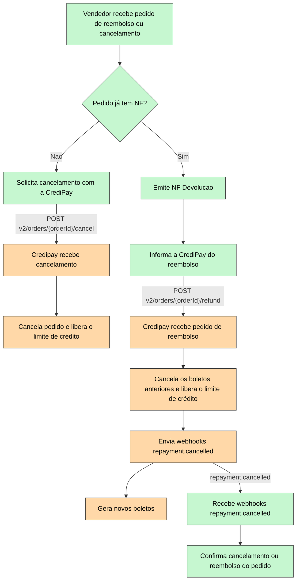

# Introdução

Quando algo não ocorre como planejado (por exemplo, produtos danificados, extravios, desistências, etc.) com um pedido, as cobranças ao comprador deverão ser ajustadas para refletirem corretamente a realidade. Em cenários assim, o cancelamento ou o valor a ser subtraído da cobrança deve ser informado para a CrediPay, para que os boletos sejam devidamente ajustados.

Vale ressaltar que o endpoint **POST v2/orders/\{orderId}/refund** é assíncrono. Assim que os processos de reembolso forem executados, será enviado um webhook repayment.cancelled confirmando o reembolso. Em caso de reembolsos parciais, pode ser interessante receber os novos boletos - para isso, cheque a página \[2.1. Recebimento de boletos]

# Fluxo

Legenda:

* :green_square: Verde: Ações tomadas pelo vendedor
* :orange_square: Laranja: Ações tomadas pela CrediPay

 

