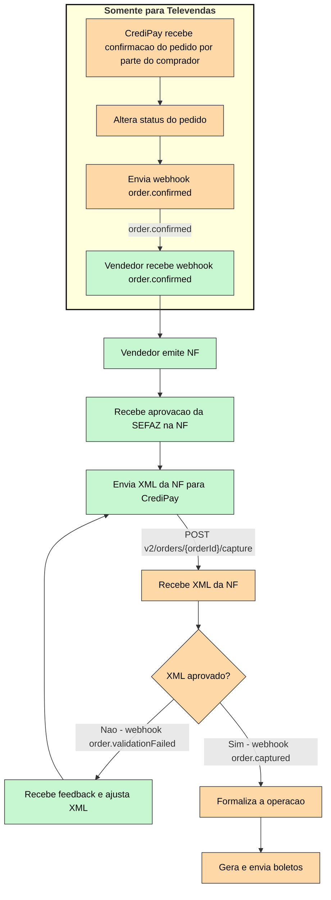

# Introdução

Ao criar um pedido (e reservar o limite de crédito), a CrediPay enviará automaticamente um email de confirmação para o comprador. Quando o comprador acessar o email e confirmar o pedido, nós enviaremos um webhook order.confirmed e mudaremos o status do pedido.

Sendo feito isso, a Nota Fiscal deve ser emitida e enviada em seguida (não é possível enviar uma NF antes que o pedido seja confirmado). A CrediPay somente formalizará e se comprometerá com a transação uma vez que a NF seja aceita. Para mais informações sobre os critérios de aceite, acesse \[link para POST v2/orders/`{orderId}`/capture]\[link para POST v2/orders/`{orderId}`/capture].

Quando o XML de uma NF for aceito, os boletos serão emitidos automaticamente e enviados ao comprador. Para o integrador, pode ser interessante receber esses arquivos também. Para isso, cheque [Recebimento de boletos](doc:api-usage-receber-boletos)

# Fluxo

**Legenda:**

* :green_square: Verde: Ações tomadas pelo vendedor
* :orange_square: Laranja: Ações tomadas pela CrediPay

 

<Image align="center" className="border" border={true} width="300px" src="https://files.readme.io/37c0da471f3ed0ef38ac9063ed2b2f7d41122e2cd676471451111942d2549087-Editor___Mermaid_Chart-2025-04-25-194833.png" />