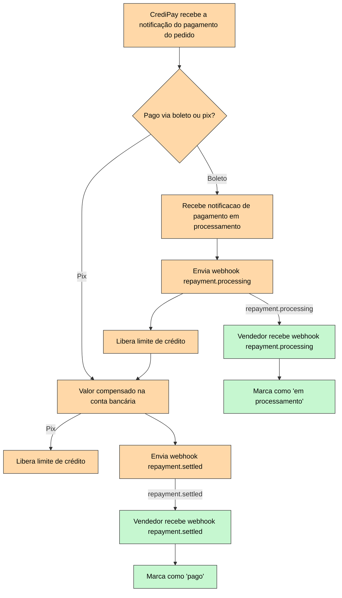

# Introdução

Sempre que um comprador pagar a CrediPay, comunicação será toda feita via webhooks. São 2 tipos:

* **repayment.processing**: Enviado assim que o comprador paga o boleto (não se aplica a Pix), mesmo que os valores não tenham sido compensados ainda.
* **repayment.settled**: Enviado assim que os valores são compensados em nossa conta bancária.

Para fins de liberação de limite de crédito, usamos o momento do repayment.processing, assim conseguimos habilitar compradores a transacionar novamente assim que realizam o pagamento.

IMPORTANTE: **Todas** as cobranças da CrediPay são feitas via BolePix, ou seja, os compradores têm a opção de pagar tanto por boleto, quanto por Pix.

# Fluxo

**Legenda:**

* :green_square: Verde: Ações tomadas pelo vendedor
* :orange_square: Laranja: Ações tomadas pela CrediPay

 

